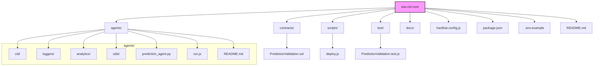

# wia-cid-core

A modular, multi-agent prediction and drift detection system using Ethereum smart contracts, entropy analysis, and agentic simulation.

## Overview

The wia-cid-core project provides a comprehensive framework for decentralized prediction validation and behavioral analysis using Ethereum smart contracts and multi-agent simulations. It enables agents to submit and resolve predictions on-chain, while off-chain components log events, analyze prediction confidence and entropy drift, and simulate diverse agent personas to test system robustness.

### Core Components

- **Solidity Smart Contracts:** The `PredictionValidation.sol` contract on the Ethereum Sepolia testnet manages prediction submissions and resolutions.
- **CID Agents:** Node.js-based agents simulating different prediction personas, submitting predictions and interacting with the contract.
- **Python Prediction Agent:** A Python script for submitting and optionally resolving predictions.
- **Event Loggers:** Components that listen to contract events, log them to JSON files, and upload logs to IPFS for decentralized archival.
- **Analytics Scripts:** Tools analyzing prediction confidence distributions and entropy drift to detect anomalies and emergent patterns.

## Project Structure



## Installation and Setup

### Prerequisites

- Node.js (v20.x or later recommended)
- npm (comes with Node.js)
- Python 3.x
- pip (comes with Python)

### Installation

1. Clone the repository:

   ```bash
   git clone <repository-url>
   cd wia-cid-core
   ```

2. Install Node.js dependencies:

   ```bash
   npm install
   ```

3. Install Python dependencies:

   ```bash
   pip install web3 python-dotenv
   ```

### Environment Configuration

1. Copy `.env.example` to `.env` in the project root:

   ```bash
   cp .env.example .env
   ```

2. Edit `.env` to fill in the required variables:

   - `SEPOLIA_URL`: RPC endpoint for Sepolia testnet (e.g., Infura URL)
   - `SEPOLIA_PRIVATE_KEY`: Private key for your wallet
   - `WALLET_ADDRESS`: Your Ethereum wallet address
   - `CONTRACT_ADDRESS`: Address of the deployed `PredictionValidation` contract
   - `W3_SPACE_DID` and `W3_REGISTERED_EMAIL`: For web3.storage IPFS uploads

### Contract Deployment

Compile and deploy the smart contract to Sepolia:

```bash
npx hardhat compile
npx hardhat run scripts/deploy.js --network sepolia
```

Update the `CONTRACT_ADDRESS` in your `.env` file with the deployed contract address.

### Optional: web3.storage CLI Setup for IPFS Logging

To enable IPFS logging, install and configure the web3.storage CLI as described in the [agents README](./agents/README.md).

## Usage Examples

### Running CID Agents

Run a CID agent with a specified persona:

```bash
node agents/run.js --persona <PersonaName>
```

Available personas:

- `Obfuscator`
- `Contrarian`
- `Overconfident`
- `EntropyBomber`

### Running the Python Prediction Agent

```bash
python agents/prediction_agent.py
```

Modify the script to customize prediction details.

### Running Event Poller Logger

Continuously listen for contract events and log them:

```bash
node agents/loggers/EventPoller.js
```

Consider using `pm2` or `nodemon` for process management.

### Uploading Logs to IPFS

```bash
node agents/loggers/logToIPFS.js
```

Run manually or schedule periodically.

### Running Drift Analysis

Perform entropy drift analysis:

```bash
node agents/analytics/driftDetector_v2.js
```

## Testing

Run the full test suite for the smart contracts:

```bash
npx hardhat test
```

## Further Information

- [Agents README](./agents/README.md)
- [Analytics README](./agents/analytics/README.md)

---

© 2025 Wallet Intelligence Agency / Counterintelligence Division
