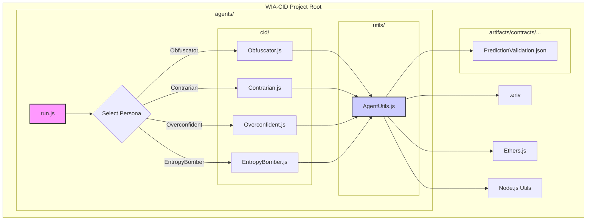

# Agents Directory - WIA-CID Project

## Introduction

The `agents/` directory contains various components designed to interact with the WIA-CID `PredictionValidation` smart contract on the Ethereum Sepolia testnet. These components simulate different agent personas that submit predictions, log contract events, and analyze system behavior to detect anomalies or emergent patterns. The agents are implemented primarily in Node.js and Python, with supporting analytics and logging utilities.

The main categories of components are:

- CID Agents (Node.js SDK) with multiple personas
- Prediction Agent (Python)
- Logging components for event capture and decentralized storage
- Analytics scripts for drift and entropy analysis

---

## Prerequisites & Setup

### Environment

- Node.js (v20.x or later recommended)
- npm (comes with Node.js)
- Python 3.x
- pip (comes with Python)

### Dependencies

- Install Node.js dependencies by running in the project root:
  ```bash
  npm install
  ```
- Install Python dependencies:
  ```bash
  pip install web3 python-dotenv
  ```

### Environment Variables

Create a `.env` file in the project root (`c:/Users/ryros/WIA-CID/.env`) with the following variables:

```dotenv
SEPOLIA_URL=https://sepolia.infura.io/v3/YOUR_INFURA_PROJECT_ID_OR_OTHER_RPC
SEPOLIA_PRIVATE_KEY=your_private_key_here
WALLET_ADDRESS=your_wallet_address_here
CONTRACT_ADDRESS=deployed_contract_address_here
W3_REGISTERED_EMAIL=your_email@example.com
W3_SPACE_DID=did:key:z6M...your_space_did...
```

- `SEPOLIA_URL`: RPC endpoint for Sepolia testnet
- `SEPOLIA_PRIVATE_KEY`: Private key for your wallet
- `WALLET_ADDRESS`: Your wallet address
- `CONTRACT_ADDRESS`: Address of the deployed `PredictionValidation` contract
- `W3_REGISTERED_EMAIL` and `W3_SPACE_DID`: For web3.storage IPFS uploads

### web3.storage CLI Setup (for IPFS Logging)

To enable IPFS logging, install and configure the web3.storage CLI:

```bash
npm install -g @web3-storage/w3cli
npx @web3-storage/w3cli login your_email@example.com
npx @web3-storage/w3cli space create your-space-name
npx @web3-storage/w3cli space ls
npx @web3-storage/w3cli space use did:key:z6M...your_space_did...
```

---

## Running Components

### CID Agents (Node.js)

The CID agents simulate different prediction personas.

- Run the agent runner script with the desired persona:

```bash
node agents/run.js --persona <PersonaName>
```

- Available personas:
  - `Obfuscator`
  - `Contrarian`
  - `Overconfident`
  - `EntropyBomber`

### Prediction Agent (Python)

A Python script to submit and optionally resolve predictions.

- Run the script:

```bash
python agents/prediction_agent.py
```

- Modify the example usage in the script to customize prediction details.

### Loggers

- **EventPoller.js**: Listens for contract events and logs them to `audit_log.json`.

```bash
node agents/loggers/EventPoller.js
```

Run continuously; consider using `pm2` or `nodemon`.

- **logToIPFS.js**: Uploads `audit_log.json` to IPFS and records the CID.

```bash
node agents/loggers/logToIPFS.js
```

Run manually or schedule periodically.

### Analytics

- **driftDetector.js**: Basic analysis of prediction confidence and entropy.

```bash
node agents/analytics/driftDetector.js
```

- **driftDetector_v2.js**: Temporal drift analysis comparing entropy over time.

```bash
node agents/analytics/driftDetector_v2.js
```

---

## CID Agent Personas

- **Obfuscator**: Submits predictions with ambiguous descriptions and altered variable hashes to obfuscate intent.
- **Contrarian**: Submits predictions that invert or oppose the latest on-chain prediction.
- **Overconfident**: Submits predictions with a fixed confidence of 100%.
- **EntropyBomber**: Rapidly submits multiple random predictions to increase entropy.

---

## Logging Components

- **EventPoller.js**: Connects to the blockchain RPC, listens for `PredictionSubmitted` and `PredictionResolved` events, and appends structured event data to `audit_log.json`.
- **logToJson.js**: Internal handler used by the poller to write JSON logs.
- **logToIPFS.js**: Uploads the current `audit_log.json` to IPFS via web3.storage and records the resulting CID in `log_cid_history.json`.

Output files:

- `audit_log.json`: Append-only JSON array of captured contract events.
- `log_cid_history.json`: History of IPFS CIDs for uploaded logs.

---

## Analytics Components

- **driftDetector.js**: Analyzes `audit_log.json` to calculate confidence distribution, entropy score, and agent activity.
- **driftDetector_v2.js**: Extends the above by tracking entropy drift over time using `drift_history.json`.

Input/output files:

- Input: `audit_log.json`
- Output (v2): `drift_history.json`

---

## CID Agent Architecture Diagram



---

This README provides new developers with a clear understanding of the agents' purpose, setup, usage, and architecture within the WIA-CID project.
