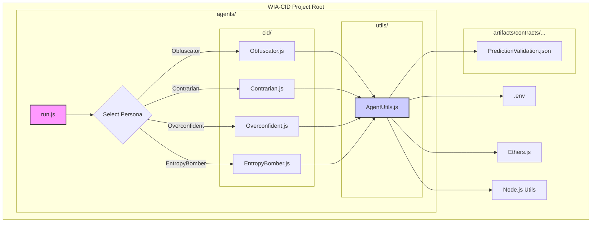

# CID Agent SDK Refactoring Plan

This document outlines the plan to refactor the existing CID agent into a modular SDK structure.

## Phase 1: Scaffolding and Core Utilities

1.  **Create Directory Structure:**
    - Create `agents/cid/`
    - Create `agents/utils/`
2.  **Develop `AgentUtils.js` (`agents/utils/AgentUtils.js`):**
    - **Environment Loading:** Implement `dotenv` loading using `require("dotenv").config({ path: path.resolve(__dirname, "../../.env") });` to correctly load from the project root. Export loaded variables (`SEPOLIA_URL`, `SEPOLIA_PRIVATE_KEY`, etc.).
    - **Ethers Setup:** Initialize and export `provider`, `wallet`, and the `contract` instance using the loaded environment variables and the confirmed ABI path (`path.resolve(__dirname, "../../artifacts/contracts/PredictionValidation.sol/PredictionValidation.json")`).
    - **Shared Utilities:** Migrate `getRandomConfidence`, `getAmbiguousDescription`, `generateFakeVariablesHash` from the old `CID_agent.js` and export them.
    - **Contract Interaction:** Add a basic `submitPrediction` wrapper function that takes prediction parameters and calls `contract.submitPrediction`.
    - **Prediction Fetching:** Add a function `getLatestPrediction()` that fetches the most recent prediction details from the contract (implementation might involve querying events or a specific contract view function if available).

## Phase 2: Persona Implementation

1.  **Refactor `Obfuscator.js` (`agents/cid/Obfuscator.js`):**
    - Import necessary functions/objects from `AgentUtils.js`.
    - Adapt the existing logic from `CID_agent.js` to use the utilities.
    - Export an async `run()` function that performs the obfuscated submission.
2.  **Implement `Contrarian.js` (`agents/cid/Contrarian.js`):**
    - Import utilities from `AgentUtils.js`.
    - Implement the logic:
      - Call `getLatestPrediction()`.
      - If a prediction exists, invert confidence, modify description, slightly alter `variablesHash`.
      - If no prediction, generate random data.
      - Call the `submitPrediction` wrapper.
    - Export an async `run()` function.
3.  **Implement `Overconfident.js` (`agents/cid/Overconfident.js`):**
    - Import utilities from `AgentUtils.js`.
    - Reuse random generation logic (like Obfuscator).
    - Set confidence explicitly to `100`.
    - Call the `submitPrediction` wrapper.
    - Export an async `run()` function.
4.  **Implement `EntropyBomber.js` (`agents/cid/EntropyBomber.js`):**
    - Import utilities from `AgentUtils.js`.
    - Implement the loop (5-10 iterations).
    - Inside the loop: generate random data, call `submitPrediction`, use `setTimeout` for a 1-5 second delay.
    - Handle potential nonce issues if submissions are very rapid (may need sequential execution or nonce management).
    - Export an async `run()` function.

## Phase 3: Runner Script and Cleanup

1.  **Create `run.js` (`agents/run.js`):**
    - Add a dependency for a CLI argument parser (e.g., `yargs`: `npm install yargs`).
    - Parse the `--persona` argument.
    - Use a `switch` statement or dynamic import (`require(\`./cid/\${personaName}.js\`)`) based on the persona name.
    - Call the imported persona's `run()` function.
    - Include error handling for invalid persona names or execution errors.
2.  **Cleanup:** Delete the old `agents/CID_agent.js` file.
3.  **(Optional) Add `agents/README.md`:** Document how to run agents (e.g., `node agents/run.js --persona Obfuscator`) and briefly describe each persona.

## Visual Structure

