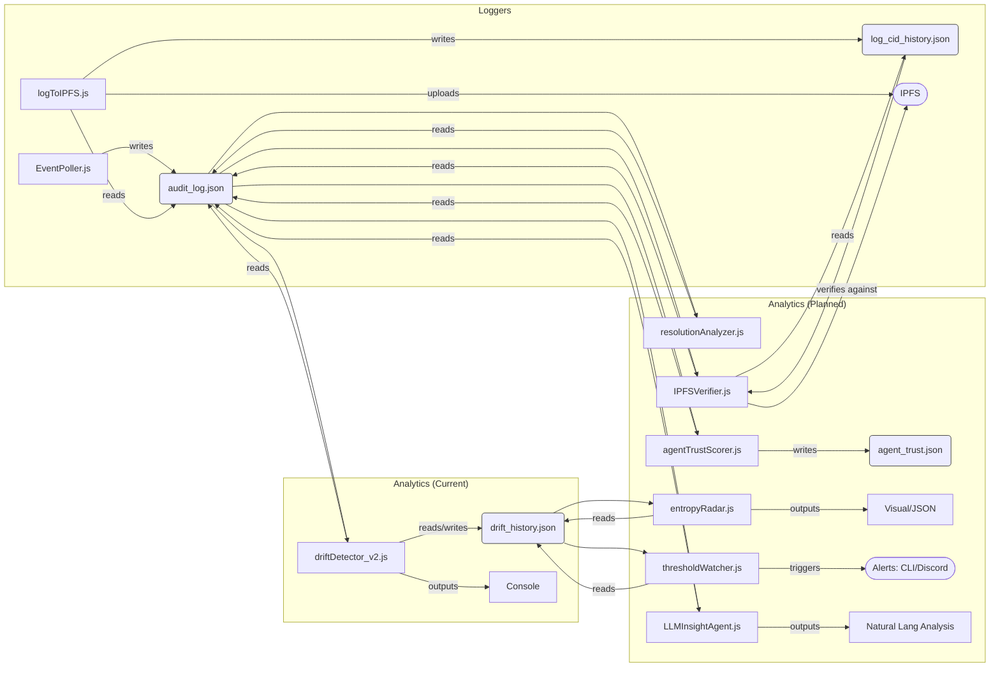

# Analytics Components - WIA-CID Project

## Introduction

The `analytics` directory contains components designed to monitor and analyze the behavior of agents within the WIA-CID system. These tools operate primarily on the `audit_log.json` event log generated by the logging components, providing insights into prediction confidence distributions, entropy drift, and emergent patterns. The goal is to detect anomalies, manipulation attempts, or systemic shifts that may impact the integrity and resilience of the prediction ecosystem.

## Current Components

### driftDetector_v2.js (Primary)

`driftDetector_v2.js` is the current temporal entropy drift monitoring tool. It extends the initial drift detector by tracking entropy changes over time to identify significant shifts in prediction confidence distributions.

**Functionality:**

- Reads `audit_log.json` to gather prediction submission events.
- Categorizes prediction confidence into three buckets: low, medium, and high.
- Calculates the Shannon entropy score of the confidence distribution.
- Loads historical entropy data from `drift_history.json`.
- Compares the current entropy score with the last recorded value to compute entropy drift.
- Outputs a detailed analysis report including total predictions, confidence distribution, entropy score, top active agents, and entropy drift.
- Flags significant entropy changes exceeding a threshold (0.2 absolute difference).
- Appends the current analysis to `drift_history.json` for ongoing temporal tracking.

**Input/Output Files:**

- Input: `audit_log.json`
- Input/Output: `drift_history.json`

**Example Output:**

```
Drift Analysis Report:
----------------------
Total Predictions: 150
Confidence Distribution: { low: 40, medium: 70, high: 40 }
Entropy Score: 1.4852
Top Active Agents:
- EntropyBomber: 50 predictions
- Overconfident: 30 predictions
Entropy Drift Since Last Scan: -0.2150
⚠️  Significant entropy change detected.
```

### driftDetector.js (Legacy)

`driftDetector.js` is the initial version of the drift detector. It performs a single-point-in-time entropy calculation without historical comparison. While useful for snapshot analysis, it has been superseded by `driftDetector_v2.js` for temporal drift tracking.

## Technical Details

### Confidence Distribution & Entropy Rationale

The analytics tools use the distribution of prediction confidence levels as a proxy for the system's behavioral state. Predictions are bucketed into low, medium, and high confidence categories, reflecting the diversity and certainty of agent submissions.

### Shannon Entropy Calculation

Entropy measures the uncertainty or randomness in the confidence distribution. It is calculated using the Shannon entropy formula:

\[
H = - \sum\_{i} p_i \log_2 p_i
\]

Where:

- \( p_i \) is the proportion of predictions in confidence bucket \( i \) (low, medium, high).
- The sum is over all three buckets.

Higher entropy indicates a more diverse and uncertain prediction set, while lower entropy suggests clustering or potential manipulation.

### Temporal Analysis (v2)

Tracking entropy changes over time (entropy drift) provides a dynamic view of system behavior. Sudden or sustained shifts in entropy can signal emergent phenomena, adversarial activity (e.g., coordinated prediction flooding), or systemic instability.

## Planned Extensions (Roadmap)

The analytics module is evolving into a comprehensive suite of tools:

- **resolutionAnalyzer.js:** Analyzes resolved predictions to compute agent accuracy and calibration scores.
- **agentTrustScorer.js:** Aggregates outcomes into rolling trust scores per agent, stored in `agent_trust.json`.
- **entropyRadar.js:** Generates visual or JSON outputs showing entropy drift over time, detecting phase shifts and pattern emergence. (Will utilize `drift_history.json`.)
- **thresholdWatcher.js:** Triggers alerts (CLI or Discord) if systemic entropy drops too low or spikes, simulating awareness of behavioral tipping points.
- **IPFSVerifier.js:** Verifies that on-chain events match historical audit logs pinned to IPFS, detecting tampering or inconsistencies.
- **LLMInsightAgent.js (Phase 3):** Uses large language models (e.g., GPT, Claude) to analyze recent logs in natural language, answering questions like “Are any agents behaving abnormally?” or “What changed in the last 5 scans?”

## Integration with Agent System



The current data flow starts with `EventPoller.js` capturing contract events into `audit_log.json`. The `driftDetector_v2.js` reads this log, performs entropy drift analysis, and updates `drift_history.json`. Future components will build on this data to provide trust scoring, alerting, visualization, and natural language insights.

## Prerequisites & Configuration

- Refer to the main `agents/README.md` for Node.js environment setup and `.env` configuration.
- Ensure `audit_log.json` exists and contains `PredictionSubmitted` events.
- `driftDetector_v2.js` will create and update `drift_history.json` automatically.
- Dependencies are managed via the root project `package.json`.

## How to Run

Run the drift detectors using Node.js:

```bash
node agents/analytics/driftDetector.js
node agents/analytics/driftDetector_v2.js
```

`driftDetector_v2.js` is the recommended script for ongoing monitoring and analysis.

---

This README provides developers with a clear understanding of the analytics components, their current capabilities, technical underpinnings, and future direction within the WIA-CID project.
